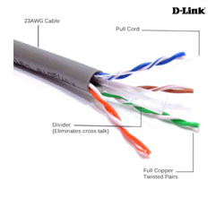
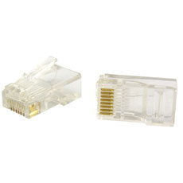
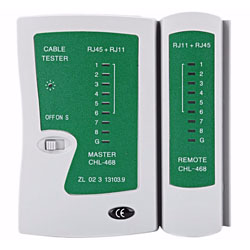

# Cable Crimping and Wireshark

## Table of Contents
+ 1.[Wire Crimping](#1-wire-crimping)
     + 1.1 [Required Equipment](#11-required-equipment)
     + 1.2 [Types of Configuration on UTP Cable](#12-cable-configuration)
     + 1.3 [Steps](#13-steps)
+ 2.[Wireshark](#2-wireshark)
	+ 2.1 [Installation](#21-Installation)
	+ 2.2 [Filters](#22-filters)
	+ 2.3 [Exporting captured data](#23-exporting-captured-data)
	+ 2.4 [Wireshark use on FTP Server](#24-wireshark-use-on-ftp-server)

## 1. Wire Crimping
In computer network, communication happens between devices. Of course that communication needs some kind of media to deliver the data. Even though we already have wireless technology, cable still play an important role. That's why in this module we will learn how to _crimp_ a type of networking cable called UTP (Unshielded Twisted Pair) cable.

### 1.1 Required Equipment
To do _wire crimping_ we need these equipments:
#### a. UTP Cable

This cable is the main material of this process.
#### b. RJ45

RJ45 is a connector that connects the UTP cable to the device.
#### c. Crimping Tool

This tool is used to install the cable into the RJ45.
#### d. LAN Tester

As the name suggests, this thing is used to check whether the cable you crimp works fine or not.
### 1.2 Cable Configuration
There are some types of cable configuration. From the international standard color sequences, we can classify it into two. They are __T568A__ and __T568B__.

Whilst from the the type of installation, we can classify it to
#### a. __Straight-Through Cable__
