# Cable Crimping and Wireshark

## Table of Contents
+ 1.[Wire Crimping](#1-wire-crimping)
     + 1.1 [Required Equipment](#11-required-equipment)
     + 1.2 [Types of Configuration on UTP Cable](#12-cable-configuration)
     + 1.3 [Steps](#13-steps)
+ 2.[Wireshark](#2-wireshark)
	+ 2.1 [Installation](#21-installation)
	+ 2.2 [Filters](#22-filters)
	+ 2.3 [Exporting captured data](#23-exporting-captured-data)
	+ 2.4 [Wireshark use on FTP Server](#24-wireshark-use-on-ftp-server)

## 1. Wire Crimping
In computer network, communication happens between devices. Of course that communication needs some kind of media to deliver the data. Even though we already have wireless technology, cable still play an important role. That's why in this module we will learn how to _crimp_ a type of networking cable called UTP (Unshielded Twisted Pair) cable.

### 1.1 Required Equipment
To do _wire crimping_ we need these equipments:
#### a. UTP Cable


This cable is the main material of this process.
#### b. RJ45


RJ45 is a connector that connects the UTP cable to the device.
#### c. Crimping Tool


This tool is used to install the cable into the RJ45.
#### d. LAN Tester


As the name suggests, this thing is used to check whether the cable you crimp works fine or not.
### 1.2 Cable Configuration
There are some types of cable configuration. From the international standard color sequences, we can classify it into two. They are __T568A__ and __T568B__.


Whilst from the the type of installation, we can classify it to
#### a. __Straight-Through Cable__
This type of wiring is used to connect two different types of devices connected to the network, namely DTE (Data Terminal Equipment) to DCE (Data Circuit-terminating Equipment) or vice versa. DTE devices are devices that generate digital data and act as a source and destination for digital data, for example computers, microcomputers, terminals, and printers. DCE is a device that receives and converts data to a suitable telecommunication link, generally DCE is a network device such as a router, switch, and modem.
  
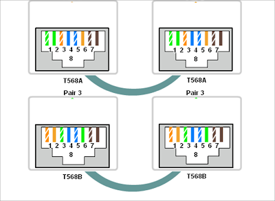

The installation rule is that each end of the wire must be in the same color order. For example, one end uses a color arrangement based on the T568A rule then so does the other end.
	
#### b. __Crossover Cable__
In contrast to straight-through cables, this wiring is used to connect the same types of devices connected to the network, namely DTE to DTE or DCE to DCE devices. For example between a computer with a computer, a router with a router, a router with a switch, or a computer with a printer.
	


Even the installation rules are different from the straight-trough cable. The Crossover cable has different color order at both ends of the cable. However, this color difference should not be arbitrary, because these two ends also have color order rule. On a standard crossover type cable, if one end of the cable is colored according to the T568A rule, then the other end of the cable must have a color order according to the T568B standard.

### 1.3 Steps
1. Prepare the crimping materials (UTP cable, RJ45, crimping tools, LAN tester)
2. Peel off the UTP cable shield
3. Sort the cables according to the desired configuration (Straight / Cross / others).
4. Cut the end of the cable to even out the tip.
5. Insert the end of the cable into the RJ45 and make sure it touches the RJ45 end.
6. Use crimping tool to lock the UTP cable in the RJ45 (make sure the end of the cable is still attached to the RJ45 end when the locking is being done)
7. Finally, use a LAN tester to make sure the cable you make is working properly.

## 2. Wireshark
Wireshark is a network packet analyzer application. Network packet analyzer will try to capture network packets and try to display packet data as detailed as possible.
A computer network is built with the aim of sending or receiving data from one end-point to another. Data is sent in packets. The structure of a network packet consists of:

***1. Header***
The header section contains the address and other data carried by the packet. The structure of the header includes:

| Instructions | Description |
| - | --- |
| Package Length | Some networks already have a fixed-length packet, while others rely on the header to load this information |
| Synchronization | The few bits that help the packet match the network in question |
| Package number | Shows the order of the total packets that exist |
| Protocol | On networks carrying more than one kind of information, this protocol indicates the type of packet being transmitted: e-mail, web page, or other |
| Destination address | Where the packet is sent to |
| Address of origin | Where the packet is sent from |

***2. Payload***
The payload is also referred to as the ***body*** of the packet. This is where the data to be sent via the packet is located.

***3. Trailer***
Trailer, sometimes called ***footer***, usually contains a pair of bits that signal the receiving device that a packet has reached its end. Trailers can also contain some sort of error checking.

### 2.1 Installation
Installer for Windows OS or macOS can be downloaded at [this page](https://www.wireshark.org/download.html). For those who use Linux can read the tutorial [here](https://linuxtechlab.com/install-wireshark-linux-centosubuntu/).
After installing, run Wireshark as **administrator** (Windows) or **root** (linux)
Here's the initial look:
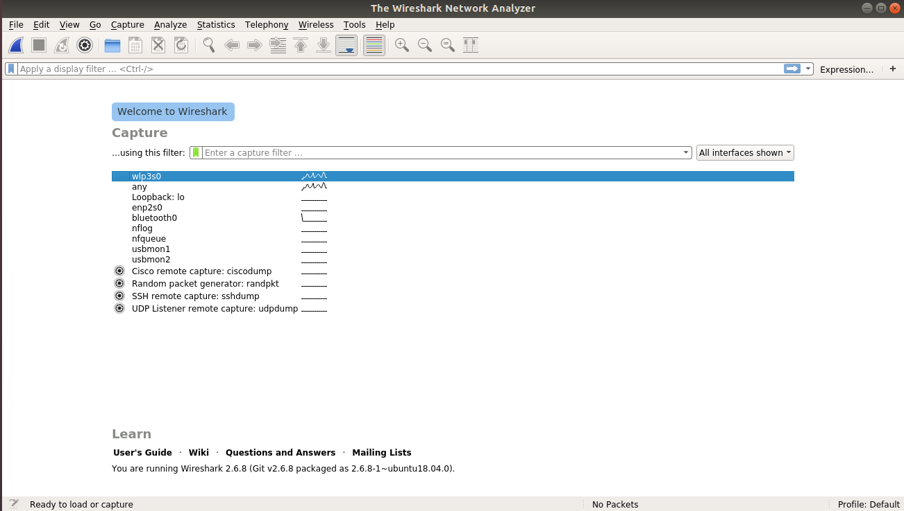

### 2.2 Filters
In Wireshark there are 2 types of filters, they are ***Capture Filter*** and ***Display Filter***

#### 2.2.1 Capture Filter
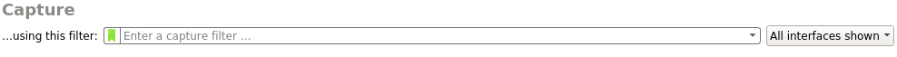

- Definition: Sorting packets that is going to be captured. Packets that do not meet the criteria are allowed to pass without being caught
- The filter's syntax can consist of 1 or more **primitive(s)**. The primitive itself usually consists of an **id** (number or name) preceded by one or more types of qualifiers. Keep in mind that in 1 primitive there cannot be 2 or more similar qualifiers
- Type of qualifier:

| Qualifier | Description | Example |
| - | - | - |
| type | Specifies the type of id or name that becomes the filter's value | host, net, port, portrange |
| dir | Specifies the direction of the id | src, etc. |
| proto | Specifies the protocol of the id | tcp, udp, and others |

- The filter's syntax can contain operators, brackets, negation (`!` / `Not`), and conjunctions (` && `/` and` or `||` / `or`). Conjunctions are used to connect 2 primitives in one syntax
- Capture filter syntax example:

| Filter expression / Primitive(s) | Description |
| - | - |
| `host 10.151.36.1` | Captures all packets that specifically going to or originating from the address 10.151.36.1 |
| `src host 10.151.36.1` | Captures all packets that specifically coming from the address 10.151.36.1 |
| `net 192.168.0.0 / 24` or` net 192.168.0.0 mask 255.255.255.0` | Capture all packets originating from or heading to the 192.168.0.0/24 subnet |
| `dst net 192.168.0.0 / 24` | Captures all packets heading to the 192.168.0.0/24 subnet |
| `udp port 80` | Capture all UDP protocol packets that are heading to or originate from port 80 |
| `tcp src port 22 or host 10.151.36.30` | Capture all packets with the TCP protocol originating from port 22 or all packets originating from or heading to the address 10.151.36.30 |

- Example of capture filter `host 10.151.36.1`
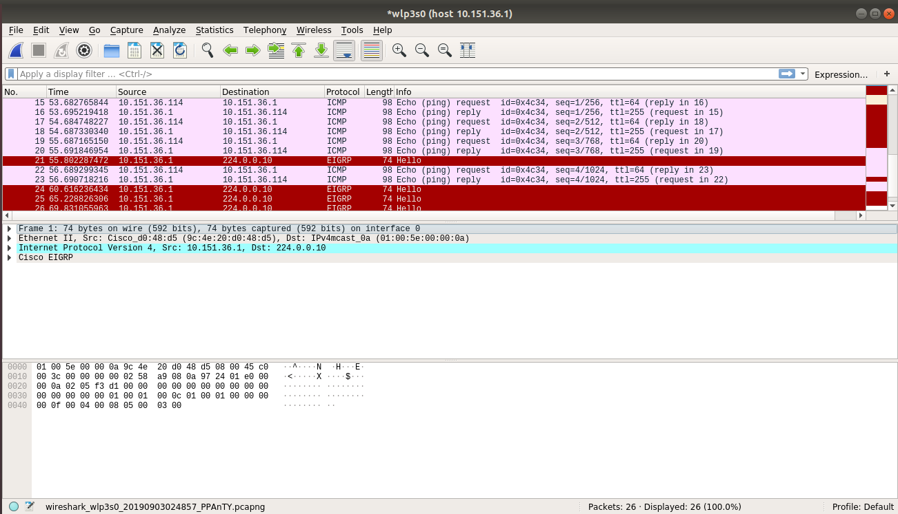

#### 2.2.2 Display Filter
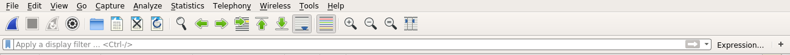
- Definition: Sorting packets to be displayed from a collection of packets that have been captured.
- In general, the display filter's syntax consists of `[protocol] [field] [comparison operator] [value]`. Here is a list of comparison operators available:

| English | Comparison Operator (C-like) | Meaning |
| --- | --- | --- |
| equal | == | Equals to |
| inequality | ! = | Not the same as |
| greater than | > | Greater than |
| less than | <| Smaller than |
| greater than or equal than | > = | Greater than or equal to |
| less than or equal to | <= | Less than or equal to |
| contains | | Protocol or field contains a specific value |
| matches | ~ | Protocol or field matches *regular expression* |
| bitwise_and | & | Compares the bit values of a field |

- In the display filter we can combine 2 filter expressions with ***logical operators***

| Logical Operators | Description |
| --- | --- |
| `and` or` && `| logical AND |
| `or` | logical OR |
| `xor` or` ^^ `| logical XOR |
| `not` or`! `| logical NOT |
| `[...]` | substring operator |
| `in` | membership operator |

- Examples of using display filters:

| Filter expression | Description |
| --- | --- |
| `tcp.port == 443` | Displays all packets with the TCP protocol going to or from port 443 |
| `ip.src == 192.168.0.1 or ip.dst == 192.168.0.1` | Displays all packets originating from the address 192.168.0.1 or heading to the address 192.168.0.1 |
| `http.request.uri constains" login "` | Returns all HTTP protocol packets whose URI contains the string "login" |

- Example of display filter `tcp.port == 80`, here are the results:
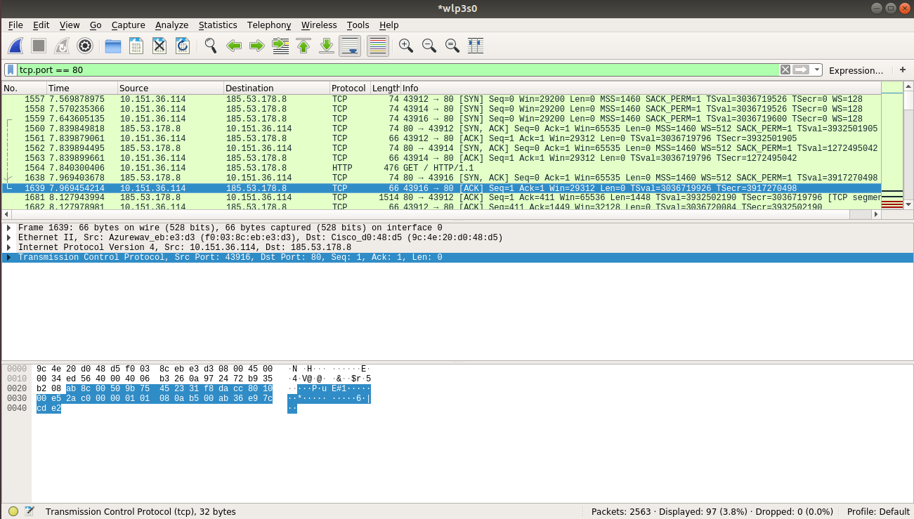

### 2.3 Exporting captured data

1. Once you have a packet, select it on the menu bar File -> Export Objects -> (the desired protocol). In this example, HTTP is selected.
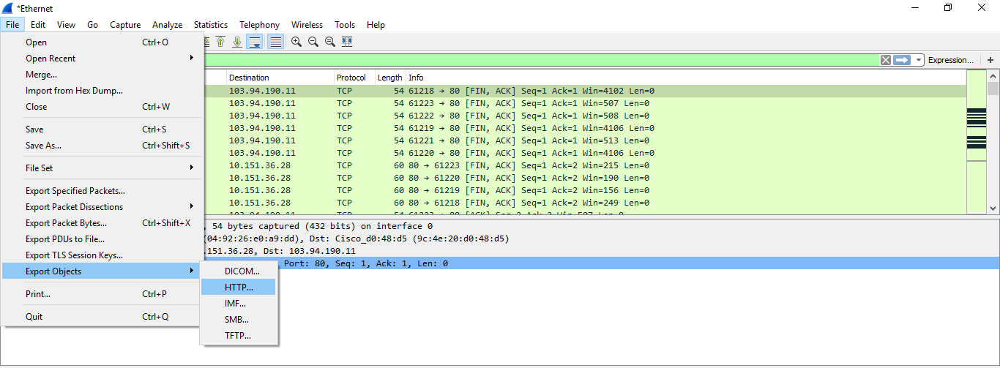
2. Select the package to be exported. In this example a package that contains images from a certain site is selected. Then click Save and provide the file name, path, and extension if needed.
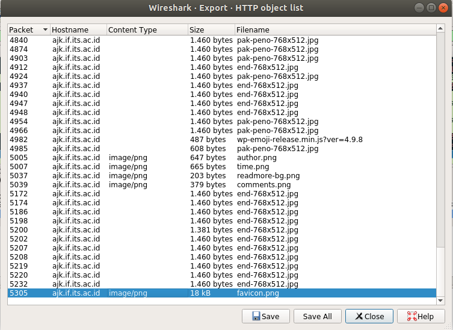
3. The file was successfully exported
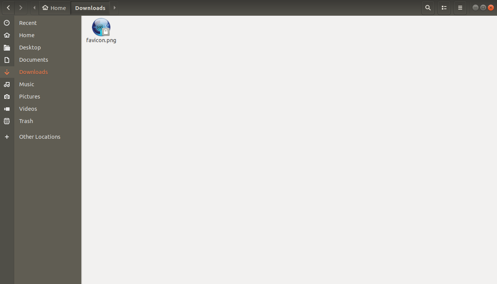

### 2.4 Wireshark use on FTP Server
Run the wireshark application before connecting to the FTP server.
#### 2.4.1 Connect to Server
##### a. Windows
For Windows users we will use **FileZilla**. For experiments on the server, we will use Filezilla Server and for the client we will use the Filezilla Client. Later the server and client can either be at the same computers or not (as long as they are connected to a computer network).

###### Creating an FTP Server on Filezilla Server
1. Open Filezilla Server (can be via the Filezilla Server desktop application or XAMPP by starting the Filezilla module and clicking the Admin button). If the "Connect to Server" pop up appears, just click Ok. The following display will appear.

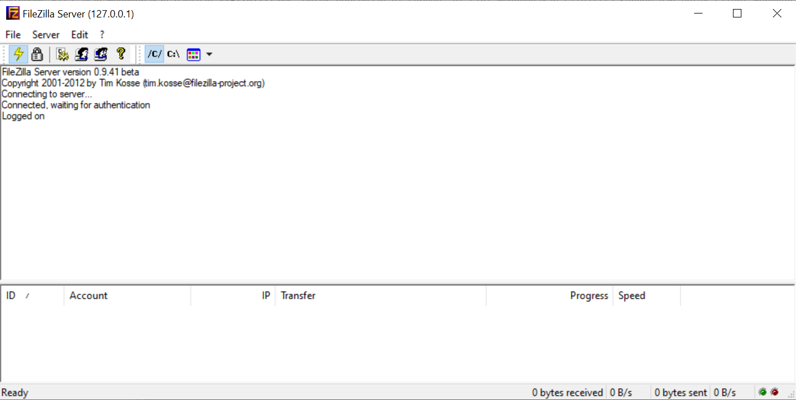

2. Click the menu Edit-> Users. In the rightmost Users column, add a new user by clicking Add and enter the FTP username. The following is the result after adding the user (here the user "coba" is added). If you wish to use a password, check "Password" and enter the desired password.

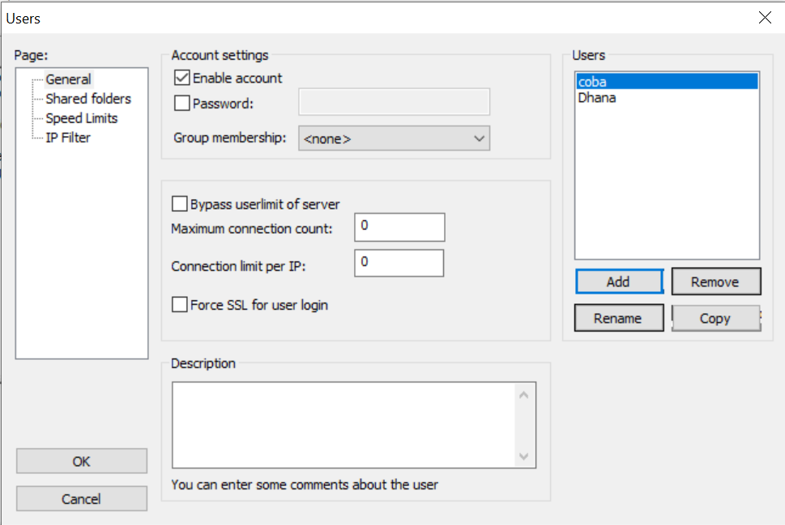

3. After the user is created, enter the shared folder settings to determine which folder will be shared or being accessed remotely by FTP. In the Users field, select a user, and in the Shared folders field, click the "Add" button to add a directory. Next, the user can set the access to the shared folders that are selected in the check boxes in the Files and Directories column.

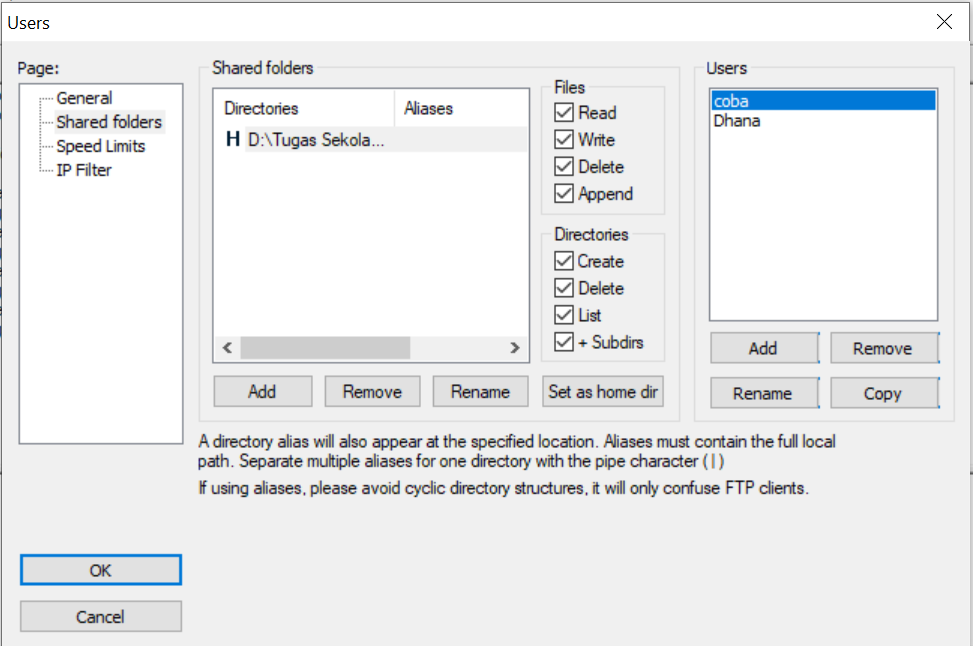

FTP server was created successfully.

#### 2.4.2 Connection from Client

##### a. Using Filezilla client
Open FileZilla and enter *Host*, *Username*, *Password*, and *Port* of the server you want to connect to. When you are sure, click *Quickconnect* to connect.

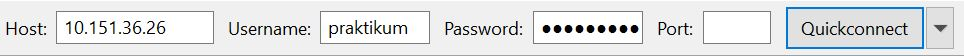

##### b. Using Linux command
`$ ftp [Host ip]`
Enter the username and password, then run like the usual CLI.

When you see the capture result from Wireshark, the data below will appear:

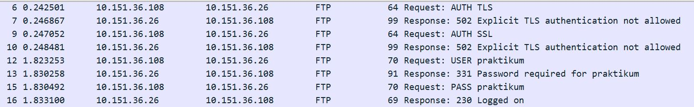

| Command | Description |
| --- | --- |
| USER | Username used to log into the FTP server |
| PWD | Password used to log into the FTP server |

#### 2.4.3 File Upload
##### a. Using Filezilla client
For those using FileZilla, drag files from Local site and drop them on Remote site

| Command | Description |
| --- | --- |
| STOR | Uploading files to FTP server |

##### b. Using Linux command
Upload command for linux
```
$ put [full path file]
```
When the capture results are seen, the data below will appear:

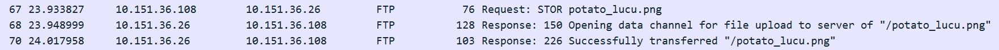

#### 2.4.4 Downloading File
##### a. Using Filezilla client
For those using FileZilla, drag files from Remote site and drop them on Local site.

| Command | Description |
| --- | --- |
| RETR | Downloading a file from FTP server |

##### b. Using Linux commands
Download command for linux
```
$ get [nama file]
```

When the capture results are seen, the data below will appear:

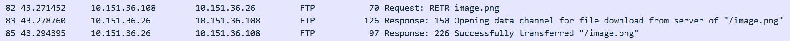

## Exercise
1. When accessing a web page, what port does a packet point to?
2. What are the differences when accessing the main page of the if.its.ac.id and monta.if.its.ac.id websites? Explain your answer.
3. How many packets were sent by the web server when downloading files? Why did something like that happen?
4. From the results of packet analysis, what is the difference between using a persistent connection and a non-persistent connection?
5. What is the difference when authenticating using the basic method and with the digest method?
6. What is the difference between accessing a normal web page and when the login process occurs?
7. What does the browser send to the web server? Export the packet capture data!

## References
+ https://nyengnyeng.com/macam-macam-kabel-jaringan-komputer/
+ http://haidirhmc.blogspot.com/2011/12/urutan-warna-kabel-lan-atau-kabel-t568a.html
+ https://www.nesabamedia.com/pengertian-dan-fungsi-kabel-utp/
+ https://www.berguruit.com/2017/09/cara-crimping-kabel-lan-rj45-yang-baik.html
+ https://www.wireshark.org/docs/wsug_html_chunked/ChapterIntroduction.html
+ https://www.wireshark.org/docs/wsug_html_chunked/ChCapCaptureFilterSection.html
+ https://www.wireshark.org/docs/wsug_html_chunked/ChWorkBuildDisplayFilterSection.html
+ https://computer.howstuffworks.com/question5251.htm]
+ https://www.comparitech.com/net-admin/difference-between-straight-through-crossover-rollover-cables/
+ https://www.indowebsite.co.id/kb/cara-mengaktifkan-ftp-pada-localhost-atau-xammp/
