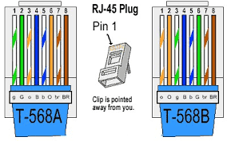
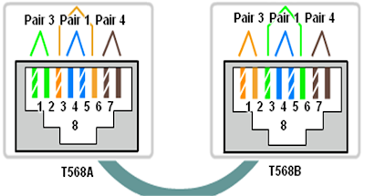

# Cable Crimping and Wireshark

## Table of Contents
+ 1.[Wire Crimping](#1-wire-crimping)
     + 1.1 [Required Equipment](#11-required-equipment)
     + 1.2 [Types of Configuration on UTP Cable](#12-cable-configuration)
     + 1.3 [Steps](#13-steps)
+ 2.[Wireshark](#2-wireshark)
	+ 2.1 [Installation](#21-Installation)
	+ 2.2 [Filters](#22-filters)
	+ 2.3 [Exporting captured data](#23-exporting-captured-data)
	+ 2.4 [Wireshark use on FTP Server](#24-wireshark-use-on-ftp-server)

## 1. Wire Crimping
In computer network, communication happens between devices. Of course that communication needs some kind of media to deliver the data. Even though we already have wireless technology, cable still play an important role. That's why in this module we will learn how to _crimp_ a type of networking cable called UTP (Unshielded Twisted Pair) cable.

### 1.1 Required Equipment
To do _wire crimping_ we need these equipments:
#### a. UTP Cable

This cable is the main material of this process.
#### b. RJ45

RJ45 is a connector that connects the UTP cable to the device.
#### c. Crimping Tool

This tool is used to install the cable into the RJ45.
#### d. LAN Tester

As the name suggests, this thing is used to check whether the cable you crimp works fine or not.
### 1.2 Cable Configuration
There are some types of cable configuration. From the international standard color sequences, we can classify it into two. They are __T568A__ and __T568B__.

Whilst from the the type of installation, we can classify it to
#### a. __Straight-Through Cable__
	This type of wiring is used to connect two different types of devices connected to the network, namely DTE (Data Terminal Equipment) to DCE (Data Circuit-terminating Equipment) or vice versa. DTE devices are devices that generate digital data and act as a source and destination for digital data, for example computers, microcomputers, terminals, and printers. DCE is a device that receives and converts data to a suitable telecommunication link, generally DCE is a network device such as a router, switch, and modem.
  

	The installation rule is that each end of the wire must be in the same color order. For example, one end uses a color arrangement based on the T568A rule then so does the other end.
	
#### b. __Crossover Cable__
	In contrast to straight-through cables, this wiring is used to connect the same types of devices connected to the network, namely DTE to DTE or DCE to DCE devices. For example between a computer with a computer, a router with a router, a router with a switch, or a computer with a printer.
	

	Even the installation rules are different from the straight-trough cable. The Crossover cable has different color order at both ends of the cable. However, this color difference should not be arbitrary, because these two ends also have color order rule. On a standard crossover type cable, if one end of the cable is colored according to the T568A rule, then the other end of the cable must have a color order according to the T568B standard.

### 1.3 Steps
1. Prepare the crimping materials (UTP cable, RJ45, crimping tools, LAN tester)
2. Peel off the UTP cable shield
3. Sort the cables according to the desired configuration (Straight / Cross / others).
4. Cut the end of the cable to even out the tip.
5. Insert the end of the cable into the RJ45 and make sure it touches the RJ45 end.
6. Use crimping tool to lock the UTP cable in the RJ45 (make sure the end of the cable is still attached to the RJ45 end when the locking is being done)
7. Finally, use a LAN tester to make sure the cable you make is working properly.

## 2. Wireshark
Wireshark is a network packet analyzer application. Network packet analyzer will try to capture network packets and try to display packet data as detailed as possible.
A computer network is built with the aim of sending or receiving data from one end-point to another. Data is sent in packets. The structure of a network packet consists of:

***1. Header***
The header section contains the address and other data carried by the packet. The structure of the header includes:

| Instructions | Description |
| - | --- |
| Package Length | Some networks already have a fixed-length packet, while others rely on the header to load this information |
| Synchronization | The few bits that help the packet match the network in question |
| Package number | Shows the order of the total packets that exist |
| Protocol | On networks carrying more than one kind of information, this protocol indicates the type of packet being transmitted: e-mail, web page, or other |
| Destination address | Where the packet is sent to |
| Address of origin | Where the packet is sent from |

***2. Payload***
The payload is also referred to as the ***body*** of the packet. This is where the data to be sent via the packet is located.

***3. Trailer***
Trailer, sometimes called ***footer***, usually contains a pair of bits that signal the receiving device that a packet has reached its end. Trailers can also contain some sort of error checking.

### 2.1 Installation
Installer for Windows OS or macOS can be downloaded at [this page](https://www.wireshark.org/download.html). For those who use Linux can read the tutorial [here](https://linuxtechlab.com/install-wireshark-linux-centosubuntu/).
After installing, run Wireshark as **administrator** (Windows) or **root** (linux)
Here's the initial look:

### 2.2 Filters
In Wireshark there are 2 types of filters, they are ***Capture Filter*** and ***Display Filter***

#### 2.2.1 Capture Filter

- Definition: Sorting packets that is going to be captured. Packets that do not meet the criteria are allowed to pass without being caught
  - The filter's syntax can consist of 1 or more **primitive(s)**. The primitive itself usually consists of an **id** (number or name) preceded by one or more types of qualifiers. Keep in mind that in 1 primitive there cannot be 2 or more similar qualifiers
  - Type of qualifier: